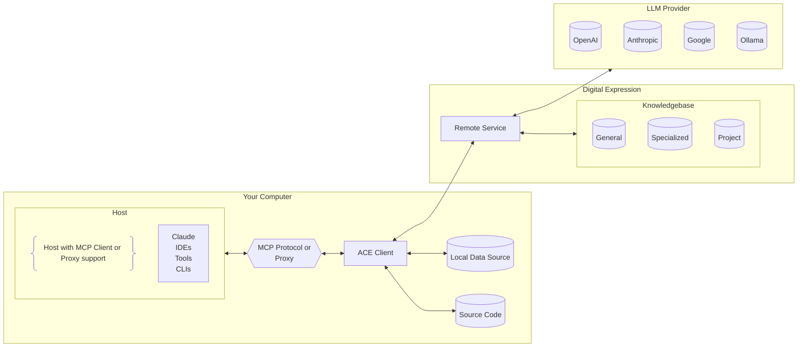

# ACE – 🤖 AI Assistant for Mobile Development

**Install via:**

```bash
npm i -g @digitalexpression/ace
```

**Run it:**

```bash
ace serve
```

---

## 🧭 Overview

**ACE** is an AI-powered assistant tailored for mobile development workflows.
Acting as a **Model Context Protocol (MCP) Server** or **OpenAI-compatible Proxy**, ACE integrates seamlessly into developer tools, CI/CD pipelines, and secure enterprise environments.

By leveraging contextual understanding of your source code and project-specific data, ACE enables faster, smarter, and more secure development at scale.

---

## 🏗️ Architecture



---

## 🚀 Key Features

### 💻 Developer Productivity

* ⚡ Real-time code analysis and suggestions
* 🧠 Contextual understanding of project structure and style
* 🛠️ Fix build errors and linter warnings
* 📄 Generate documentation and implementation guides
* 📐 Follow project-specific rules and architecture

### 🔁 CI/CD Integration

* 🕵️ Review pull requests
* 🐞 Highlight bugs, violations, and security issues
* 🧱 Enforce coding and architectural guidelines automatically

### 🔐 Security & Policy Enforcement

* 🛡️ Act as a security advisor
* ✅ Enforce secure development policies
* 🚫 Detect use of insecure or deprecated dependencies

### 📚 Knowledgebase Intelligence

* **General:** Common mobile dev practices
* **Specialized:** Curated expert knowledge
* **Project-Specific:** Codebase-derived context for precise RAG performance

---

## 🔒 Security, Compliance & Certifications

### 🏢 Company Certifications

Digital Expression is fully certified:

* ✅ **ISO 9001:2015** – Quality Management
* ✅ **ISO 20000-1:2018** – IT Service Management
* ✅ **ISO/IEC 27001:2022** – Information Security

### 📜 Vendor Compliance

* ✅ All third-party services are **ISO/IEC 27001** or **SOC 2 Type 2** certified
* ✅ All infrastructure is **GDPR compliant**

### 🗄️ Data Handling

* 🔐 Source code stays local by default
* 🔏 Embeddings are securely generated and stored in an **encrypted** backend
* 🧩 Multiple storage backends are used:

  * 📄 **Document** databases for structured project metadata
  * 🧠 **Vector** databases for semantic search
  * 🔗 **Graph** databases for relationship mapping

### 🚫 No Self-Hosting

To ensure constant access to the latest LLM and security advancements, **self-hosting is not supported**.

### 🕵️‍♀️ Code Audits

A **full source code audit** can be provided on request for enterprise validation and security review.

---

## 👨‍💻 Developer FAQ

### 🛠️ How do I use ACE?

1. Install: `npm i -g @digitalexpression/ace`
2. Configure your IDE/CLI/tool to use ACE as proxy or MCP endpoint

### 🧑‍💻 What languages are supported?

Most programming languages are supported, but we're specialized in mobile development—**Swift/SwiftUI**, **Kotlin/Jetpack Compose** are our primary focus.

### 🐞 Can ACE help with debugging?

Yes – including build failures, linter issues, and dependency problems.

### 🎯 Will ACE follow our code style and rules?

Yes – ACE can enforce project-defined guidelines.

### 🔍 Can ACE review pull requests?

Yes – integrated into CI/CD workflows to review code and suggest changes.

### 📘 Does ACE update documentation?

Yes – including docstrings, README files, and onboarding guides.

---

## 📞 Contact

For enterprise onboarding, audits, or advanced configurations:

📧 **[info@digitalexpression.ro](mailto:info@digitalexpression.ro)**

🌐 **[https://digitalexpression.ro](https://digitalexpression.ro)**
